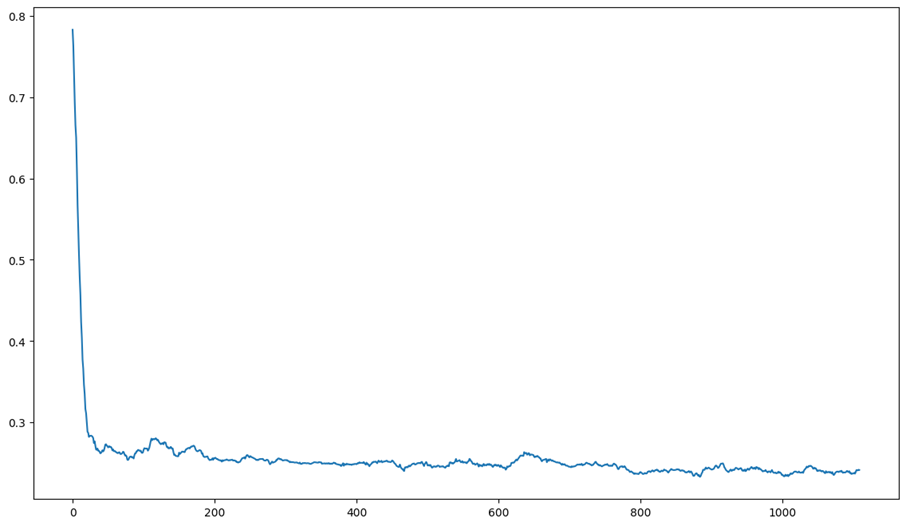

1.	Был собран датасет по сериалу «Теория большого взрыва».
2.	Был написан парсер с сайта https://bigbangtrans.wordpress.com/
3.	Основной код парсера представлен на git_hub: data_preproc.ipynb
4.	Бы собран датасет более 11 тыс. записей.
5.	В Датасет было добавлено более 11 тыс. записей с отрицательным лейблом.
6.	Основные поля датасета: context, question, answer, label
7.	Выполнено дообучение модели Cross-Encoder с добавлением токена [Cont_token] для отделения контекста и вопроса.
График обучения модели:

8.	С помощью Bi-Encoder был векторезирован текст context + question
9.	При вводе от пользователя контекста и вопроса, контекст и вопрос конкатенируются и векоризируются через модель Bi-Encoder.
10.	Полученный вектор запроса пользователя сравнивается по косинусному расстоянию с уже векторизированным корпусов (corpus.pkl и sentences.pkl).
11.	Выбирается 10 лучший результатов косинусной близости и подается корпусом ответов в дообученную модель Cross-Encoder.
12.	Для инференса модели созданы 2 метода:
a.	get_range_answers – возвращает 5 наиболее подходящих ответов.
b.	get_best_answer – возвращает самый популярный ответ.
13.	Создан файл для запуска инференса в обертке Flask (main.py)
14.	Выполнено размещение инференса на https://huggingface.co/spaces:
https://huggingface.co/spaces/PetrovDE/NLP_HW1